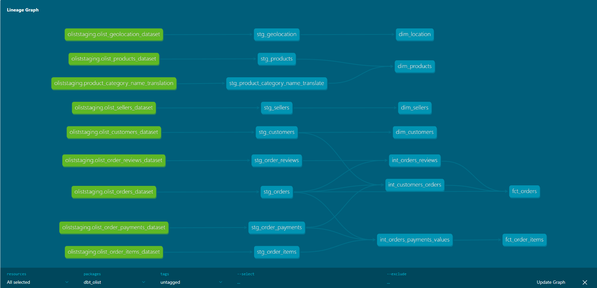
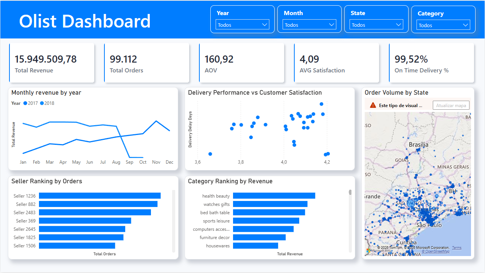

# Pipeline de Vendas Olist — Projeto de Analytics Engineering

Pipeline de dados ponta a ponta simulando um ambiente de analytics comercial, construído sobre o dataset público **Brazilian E-Commerce (Olist)**. O projeto cobre ingestão, transformação em múltiplas camadas com dbt, modelagem dimensional, testes de qualidade de dados e entrega de dashboard executivo.

> **Contexto de negócio:** Este projeto foi construído para responder perguntas reais de um Diretor Comercial fictício — cobrindo performance de vendas, ranking de vendedores, categorias de produto, ticket médio e impacto do prazo de entrega na satisfação do cliente.

---

## Arquitetura

```
CSV (Kaggle) → Python (ingestão) → PostgreSQL (raw) → dbt (staging → intermediate → marts) → Power BI
```



---

## Dashboard

O dashboard foi desenvolvido em **Power BI** utilizando o formato `.pbip` (Power BI Project), que permite versionamento completo dos arquivos no Git — diferente do formato `.pbix` (binário), o `.pbip` armazena o modelo semântico e os metadados em JSON, tornando cada alteração rastreável via controle de versão.

Os arquivos do dashboard estão na pasta `Power BI/`.



> Período do dataset: Set/2016 – Set/2018. A queda no final de 2018 reflete dados incompletos, não performance do negócio.

---

## Stack Tecnológica

| Camada | Ferramenta |
|---|---|
| Ingestão | Python (pandas, SQLAlchemy) |
| Banco de Dados | PostgreSQL 16 (container Docker) |
| Transformação | dbt-core 1.11.11 + dbt-postgres |
| Ambiente | Docker + Docker Compose |
| Visualização | Power BI |
| Administração de Banco | pgAdmin |

---

## Estrutura do Projeto

```
projeto_olist/
├── projeto_py_sql_dbt/
│   ├── dbt_olist/
│   │   ├── models/
│   │   │   ├── staging/         # Padronização (9 views)
│   │   │   ├── intermediate/    # Joins e estrutura (3 views)
│   │   │   └── marts/           # Regras de negócio, fatos e dims (6 tables)
│   │   ├── profiles.yml.example
│   │   └── dbt_project.yml
│   ├── Dockerfile
│   ├── docker-compose.yml
│   ├── extractdata.py
│   └── .env.example
└── datasets/                    # CSVs da Olist (não versionados)
```

---

## Modelos de Dados

### Staging (9 views)
Um model por tabela de origem. Padroniza nomes de colunas e tipos de dados. Sem lógica de negócio.

| Model | Descrição |
|---|---|
| stg_customers | Base de clientes |
| stg_geolocation | Coordenadas por CEP |
| stg_order_items | Itens por pedido |
| stg_order_payments | Pagamentos por pedido (agregados) |
| stg_order_reviews | Avaliações (deduplicadas pela mais recente) |
| stg_orders | Pedidos |
| stg_products | Produtos |
| stg_sellers | Vendedores |
| stg_product_category_name_translate | Tradução de categorias PT → EN |

### Intermediate (3 views)
Resolve complexidade estrutural — joins, deduplicações e agregações que preparam o terreno para os marts.

| Model | Descrição |
|---|---|
| int_customer_orders | Cliente + pedido + pagamento + geolocalização |
| int_orders_payments_values | Pedido + itens + pagamento (grão item) |
| int_orders_reviews | Pedido + avaliação (deduplicado — review mais recente por pedido) |

### Marts (6 tables)
Regras de negócio, modelo dimensional (Star Schema), métricas.

| Model | Grão | Descrição |
|---|---|---|
| fct_order_items | Item | Fato de vendas — preço, frete, vendedor, produto |
| fct_orders | Pedido | Fato de pedidos — valor total, nota, datas de entrega |
| dim_customers | Cliente | Dimensão de clientes |
| dim_sellers | Vendedor | Dimensão de vendedores (inclui registro sentinela "Unknown") |
| dim_products | Produto | Dimensão de produtos com categoria em inglês |
| dim_location | CEP | Dimensão de geolocalização (deduplicada por média de lat/lng) |

---

## Qualidade de Dados

**92 testes** em todas as camadas — `not_null`, `unique`, `accepted_values` e `relationships`.

```bash
dbt test
# Done. PASS=92 WARN=0 ERROR=0 SKIP=0 TOTAL=92
```

Principais achados durante os testes:
- `review_score` com valores aceitos [1, 2, 3, 4, 5] ✓
- Integridade referencial validada entre fatos e dimensões ✓
- 830 pedidos sem itens (cancelados/indisponíveis) — documentados como nulos válidos de negócio
- Reviews duplicadas por pedido resolvidas com window function `ROW_NUMBER()`

---

## Decisões Técnicas

**Separação de grão:** Duas tabelas fato em grãos diferentes — `fct_order_items` (item) e `fct_orders` (pedido) — para evitar fan-out ao juntar pagamentos e reviews com itens.

**Agregação de pagamentos:** `stg_order_payments` é agregado por `ord_id` antes do join com itens para evitar multiplicação de linhas por múltiplos métodos de pagamento por pedido.

**Registro sentinela de vendedor:** 830 itens sem vendedor receberam `sell_id = '9999999999999999999'` e um registro correspondente "Unknown" foi adicionado à `dim_sellers`.

**Fallback de categoria de produto:** `coalesce(nome_traduzido, nome_original, 'Uncategorized')` garante que nenhuma categoria nula chegue ao dashboard.

**Pedidos cancelados excluídos da receita:** `inner join` entre pedidos e pagamentos remove pedidos cancelados/indisponíveis (sem pagamento gerado) das métricas financeiras.

**threads: 1:** Reduzido por limitação de memória compartilhada no ambiente local com WSL2. Aumentar para deploys em cloud/servidor.

---

## Indicadores do Dashboard

| KPI | Valor |
|---|---|
| Receita Total | R$ 15,9M |
| Total de Pedidos | 99.112 |
| Ticket Médio (AOV) | R$ 160,92 |
| Nota Média de Satisfação | 4,09 / 5 |
| Taxa de Entrega no Prazo | 99,52% |

Top categorias por receita: health_beauty, watches_gifts, bed_bath_table

---

## Como Executar

### Pré-requisitos
- Docker Desktop com WSL2
- Python 3.x (local, para o script de ingestão)
- pgAdmin (opcional)

### Passo a Passo

1. Clone o repositório
2. Copie `.env.example` para `.env` e preencha suas credenciais
3. Copie `profiles.yml.example` para `profiles.yml` dentro de `dbt_olist/` e preencha suas credenciais
4. Suba o ambiente:
```bash
cd projeto_olist
docker-compose up --build
```
5. Execute o script de ingestão (fora do Docker):
```bash
python extractdata.py
```
6. Entre no container dbt e rode as transformações:
```bash
docker exec -it projeto_olist-dbt-1 bash
cd dbt_olist
dbt debug
dbt run
dbt test
```
7. Conecte o Power BI ao PostgreSQL: `localhost:5435`, banco `olist_database`, schema `analytics`

---

## Limitações Conhecidas

- O dataset cobre apenas Set/2016 – Set/2018. Os dados do final de 2018 estão incompletos.
- Nomes de vendedores não estão disponíveis no dataset Olist (marketplace anonimizado). Vendedores são identificados por ID sequencial.
- `profiles.yml` está excluído do controle de versão. Use `profiles.yml.example` como referência.
- Ambiente roda com `threads: 1` por limitação de memória no WSL2.
- O dashboard foi filtrado para exibir apenas 2017 e 2018. Os dados de 2016 foram excluídos pois o dataset inicia em setembro daquele ano, o que distorceria análises mensais e comparações anuais.

---

## Dataset

[Brazilian E-Commerce Public Dataset by Olist](https://www.kaggle.com/datasets/olistbr/brazilian-ecommerce) — Kaggle